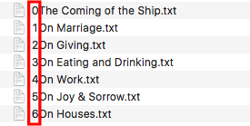

# Novel-Pad
The useful tool for anyone who can publish their own novel and article online.

[English Demo](http://smartlun.com/github/novel/)
 / 
[Chinese Demo](http://smartlun.com/novel/sixstone/)

## Basic Usage

- First you need a [web hosting](https://en.wikipedia.org/wiki/Category:Web_hosting) to upload your file.

- Upload any **TXT File Extension(.txt)** you want to display on your page. 

- The TXT file name will automatically be the article title.

- The TXT file content will automatically be article content.

## Place Order


- As above image, put the order number on the leftmost to sort them out. 

- The leftmost number will **NOT DISPLAY** as your page.

## Modify Novel Name, Author and Status

- Open index.php to find  **($NovelName / $NovelAuthor / $NovelStatus)** in the top and modify them with your editer.

## For Chinese version Usage

- Open index.php , Ctrl+F find **Chinese version**, delete **//** to comment out,  and write **//** to comment in English version.

## Prevent user copy
put JavaScript into your code
```ruby
<!-- prevent user copy start -->
<script type="text/javascript">
function iEsc(){ return false; }
function iRec(){ return true; }
function DisableKeys() {
if(event.ctrlKey || event.shiftKey || event.altKey) {
window.event.returnValue=false;
iEsc();}
}
document.ondragstart=iEsc;
document.onkeydown=DisableKeys;
document.oncontextmenu=iEsc;
if (typeof document.onselectstart !="undefined")
document.onselectstart=iEsc;
else{
document.onmousedown=iEsc;
document.onmouseup=iRec;
}
function DisableRightClick(qsyzDOTnet){
if (window.Event){
if (qsyzDOTnet.which == 2 || qsyzDOTnet.which == 3)
iEsc();}
else
if (event.button == 2 || event.button == 3){
event.cancelBubble = true
event.returnValue = false;
iEsc();}
}
</script>
<!-- prevent user copy end -->
```
And put CSS into your code
```ruby
body {
   /* prevent user copy */
  -moz-user-select : none;
  -webkit-user-select: none; 
}
```
*Notice that there is no way to prevent user copy your text when you publish in Internet.*
